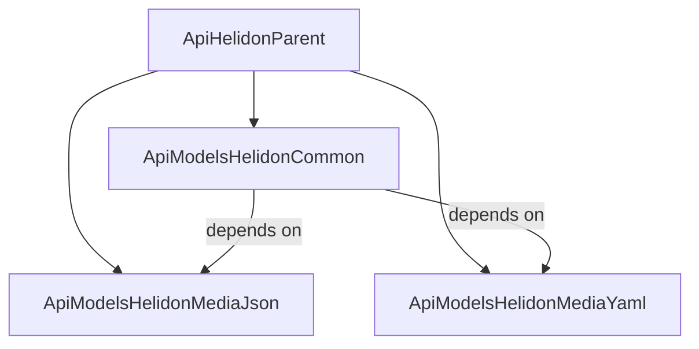
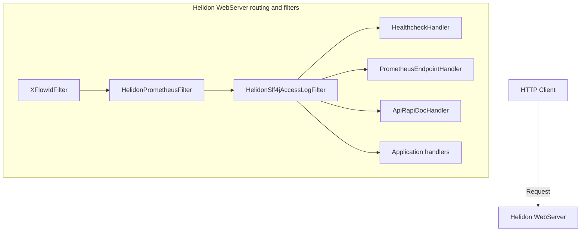

# ApiHelidonParent

Multi-module Maven parent project that provides [Helidon 4.x](https://helidon.io/) integration for the Progbits **ApiObject** model. These libraries wire Progbits API types into Helidon web servers and HTTP clients, with built-in support for JSON/YAML media handling, structured logging, distributed tracing (`X-Flow-Id`), Prometheus metrics, health checks, and interactive API documentation (RapiDoc).

**Version:** 1.3.0  
**Java:** 21  
**Helidon:** 4.5.0

## Module dependency graph



## Modules

| Module | Artifact | Description |
|--------|----------|-------------|
| [ApiModelsHelidonMediaJson](ApiModelsHelidonMediaJson/) | `com.progbits.api.helidon.media:ApiModelsHelidonMediaJson` | Helidon `MediaSupport` for reading and writing `ApiObject` as JSON |
| [ApiModelsHelidonMediaYaml](ApiModelsHelidonMediaYaml/) | `com.progbits.api.helidon.media:ApiModelsHelidonMediaYaml` | Helidon `MediaSupport` for reading and writing `ApiObject` as YAML |
| [ApiModelsHelidonCommon](ApiModelsHelidonCommon/) | `com.progbits.api.helidon.filters:ApiModelsHelidonCommon` | Server bootstrap, routing, filters, handlers, and HTTP client utilities |

`ApiModelsHelidonCommon` depends on both media modules and on other Progbits libraries (`ApiTransforms_jre21`, `ConfigProvider_jre21`).

## Features

### Media integration (JSON and YAML)

- **JSON** — [`ApiModelsJsonMediaSupport`](ApiModelsHelidonMediaJson/src/main/java/com/progbits/api/helidon/media/json/ApiModelsJsonMediaSupport.java) registers [`ApiJsonReader`](ApiModelsHelidonMediaJson/src/main/java/com/progbits/api/helidon/media/json/ApiJsonReader.java) and [`ApiJsonWriter`](ApiModelsHelidonMediaJson/src/main/java/com/progbits/api/helidon/media/json/ApiJsonWriter.java) so request and response bodies typed as `ApiObject` are serialized as `application/json`.
- **YAML** — [`ApiModelsYamlMediaSupport`](ApiModelsHelidonMediaYaml/src/main/java/com/progbits/api/helidon/media/yaml/ApiModelsYamlMediaSupport.java) registers [`ApiYamlReader`](ApiModelsHelidonMediaYaml/src/main/java/com/progbits/api/helidon/media/yaml/ApiYamlReader.java) and [`ApiYamlWriter`](ApiModelsHelidonMediaYaml/src/main/java/com/progbits/api/helidon/media/yaml/ApiYamlWriter.java) for `application/yaml` and `application/x-yaml` payloads.

### Web server

- **`WebServerProcessor`** — Creates a preconfigured `WebServerConfig.Builder` with optional `ApiObject` media handling (JSON + YAML), GZip encoding, and configuration from `application.yaml` or the Progbits `ConfigProvider`.
- **`ApiRouterProcessor`** — Fluent router setup that can register:
  - **Health checks** at `{contextPath}/healthcheck` (plain-text or HTML detail views)
  - **Prometheus metrics** at `{contextPath}/metrics`
  - **RapiDoc** at `{contextPath}/api` (serves bundled OpenAPI YAML)
  - **X-Flow-Id** request tracing (header propagation and MDC integration)
  - **SLF4J access logging**
  - Centralized error handling for `HttpException` and `ApiException`
- **`ApiHelidonUtils`** — Extract path variables, query parameters (including typed and list values), and headers from Helidon requests; send `ApiObject` responses with appropriate status codes.

### Filters

| Filter | Purpose |
|--------|---------|
| [`XFlowIdFilter`](ApiModelsHelidonCommon/src/main/java/com/progbits/helidon/filters/XFlowIdFilter.java) | Ensures every request has an `X-Flow-Id` header; stores the value in SLF4J MDC and echoes it in the response |
| [`HelidonSlf4jAccessLogFilter`](ApiModelsHelidonCommon/src/main/java/com/progbits/helidon/filters/HelidonSlf4jAccessLogFilter.java) | Structured access logging via SLF4J (method, status, duration, headers, remote address) |
| [`HelidonPrometheusFilter`](ApiModelsHelidonCommon/src/main/java/com/progbits/helidon/filters/HelidonPrometheusFilter.java) | Collects HTTP server latency histograms and request counters by path, method, and status |

### Handlers

| Handler | Endpoint | Purpose |
|---------|----------|---------|
| [`HealthcheckHandler`](ApiModelsHelidonCommon/src/main/java/com/progbits/helidon/handlers/HealthcheckHandler.java) | `{contextPath}/healthcheck` | Aggregates registered health checks by priority (`DEFAULT`, `HIGH`, `MEDIUM`, `LOW`); returns plain text or an HTML dashboard |
| [`PrometheusEndpointHandler`](ApiModelsHelidonCommon/src/main/java/com/progbits/helidon/handlers/PrometheusEndpointHandler.java) | `{contextPath}/metrics` | Exposes JVM and route-level metrics for Prometheus scraping |
| [`ApiRapiDocHandler`](ApiModelsHelidonCommon/src/main/java/com/progbits/helidon/handlers/ApiRapiDocHandler.java) | `{contextPath}/api` | Serves interactive RapiDoc UI from bundled `api-doc.yaml` |

### HTTP client

- **`WebClientUtil`** — Builds Helidon `WebClient` instances with `ApiObject` media support, optional Prometheus metrics (`webclient_totals`, `webclient_status`, `webclient_duration_seconds`), gzip/deflate compression, and automatic `X-Flow-Id` propagation from MDC.
- **`ProcessResponse`** — Decodes response payloads into Progbits `ApiObject` instances.
- Convenience methods for making HTTP calls with headers, query params, path params, and form data.

## Request pipeline



## Requirements

- **Java** JDK 21+
- **Maven** 3.x+
- **Progbits repository** — configure access to the internal artifact repository:

```xml
<repository>
    <id>ProgbitsRepo</id>
    <url>https://archiva.progbits.com/coffer/repository/internal/</url>
</repository>
```

## Usage

Add the common module to your application (it pulls in the media modules transitively):

```xml
<dependency>
    <groupId>com.progbits.api.helidon.filters</groupId>
    <artifactId>ApiModelsHelidonCommon</artifactId>
    <version>1.3.0</version>
</dependency>
```

### Bootstrapping a web server

```java
import com.progbits.helidon.utils.ApiRouterProcessor;
import com.progbits.helidon.utils.WebServerProcessor;
import io.helidon.webserver.WebServer;
import org.slf4j.Logger;
import org.slf4j.LoggerFactory;

public class MainApplication {
    private static final Logger LOG = LoggerFactory.getLogger(MainApplication.class);

    public static void main(String[] args) {
        var serverBuilder = WebServerProcessor.returnWebServer(true, true);

        serverBuilder.router(routerBuilder -> {
            ApiRouterProcessor.builder(routerBuilder, "/api")
                .xflowId("MYSERVICE")
                .prometheus("myservice")
                .healthCheck("My Service", "Production")
                .apiRapiDoc(true)
                .process(LOG);

            routerBuilder.get("/api/v1/data", (req, res) -> {
                res.send("Endpoint response content");
            });
        });

        WebServer webServer = serverBuilder.build().start();
        LOG.info("Server started on port: " + webServer.port());
    }
}
```

### Registering health checks

```java
import com.progbits.api.model.ApiObject;
import com.progbits.helidon.handlers.HealthCheck;
import com.progbits.helidon.handlers.HealthcheckHandler;
import com.progbits.helidon.utils.ApiRouterProcessor;

HealthCheck myDbCheck = () -> {
    ApiObject report = new ApiObject();
    report.setString(HealthcheckHandler.FIELD_PROGRAM, "DatabaseConnector");
    report.setString(HealthcheckHandler.FIELD_PRIORITY, "DEFAULT");

    boolean active = checkDatabaseConnection();
    report.setBoolean(HealthcheckHandler.FIELD_HEALTHCHECK, active);
    report.setString(HealthcheckHandler.FIELD_STATUS, active ? "OK" : "CONNECTION_FAILED");
    return report;
};

ApiRouterProcessor.builder(routing, "/api")
    .healthCheck("UserMicroservice", "1.3.0")
    .registerHealthCheck(HealthcheckHandler.LEVEL_DEFAULT, myDbCheck)
    .process(LOG);
```

### Downstream HTTP client calls

```java
import com.progbits.api.model.ApiObject;
import com.progbits.helidon.webclient.WebClientUtil;
import io.helidon.webclient.api.WebClient;

WebClient client = WebClientUtil.getClient("https://downstream-service.internal", true, true);

ApiObject queryParameters = new ApiObject();
queryParameters.createObject("params").setString("tenantId", "google-cloud");

ApiObject results = WebClientUtil.makeHttpCall(
    client, "/v1/users", "GET", null, "payload", queryParameters, null
);
```

## Build

Build all modules and install them locally:

```bash
mvn clean install
```

Run tests for the common module:

```bash
mvn test -pl ApiModelsHelidonCommon
```

## Project layout

```
ApiHelidonParent/
├── pom.xml
├── ApiModelsHelidonMediaJson/
│   └── src/main/java/com/progbits/api/helidon/media/json/
│       ├── ApiModelsJsonMediaSupport.java
│       ├── ApiModelsJsonProvider.java
│       ├── ApiJsonReader.java
│       └── ApiJsonWriter.java
├── ApiModelsHelidonMediaYaml/
│   └── src/main/java/com/progbits/api/helidon/media/yaml/
│       ├── ApiModelsYamlMediaSupport.java
│       ├── ApiModelsYamlProvider.java
│       ├── ApiYamlConstants.java
│       ├── ApiYamlReader.java
│       └── ApiYamlWriter.java
└── ApiModelsHelidonCommon/
    └── src/main/
        ├── java/com/progbits/helidon/
        │   ├── filters/
        │   ├── handlers/
        │   ├── utils/
        │   └── webclient/
        └── resources/
            ├── healthcheck.html
            └── rapidoc.html
```

## License

MIT License — see [LICENSE](LICENSE).
