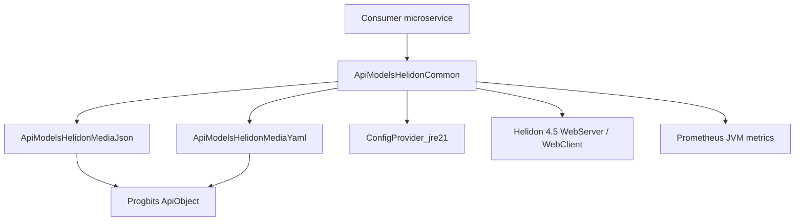
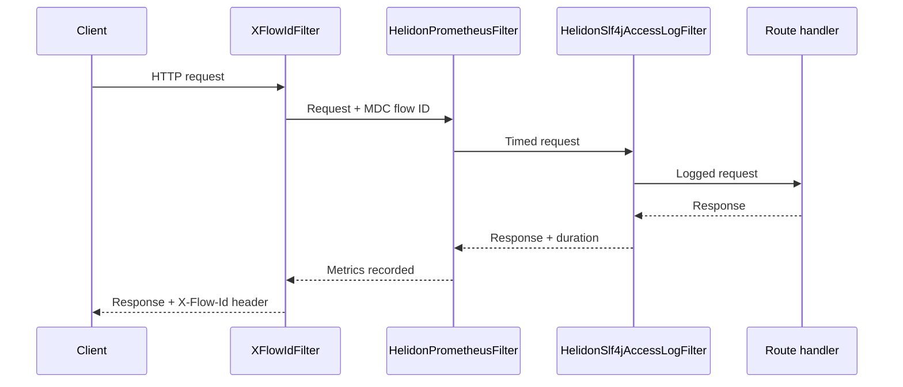

# ApiHelidonParent — Project Description

## Overview

**ApiHelidonParent** is a multi-module Maven parent project that bridges the Progbits **ApiObject** data model with [Helidon 4.x](https://helidon.io/) web servers and HTTP clients. It provides reusable libraries for building production-ready microservices that speak JSON and YAML natively through `ApiObject`, with observability, health reporting, and API documentation built in from the start.

Rather than wiring Helidon media providers, filters, and operational endpoints by hand in every service, applications depend on these modules and get a consistent stack: request/response serialization, distributed tracing, Prometheus metrics, structured access logs, health checks, and an interactive RapiDoc UI.

| Property | Value |
|----------|-------|
| Version | 1.3.0 |
| Java | 21 |
| Helidon | 4.5.1 |
| Packaging | Maven multi-module (`pom`) |
| License | MIT |

## Problem It Solves

Progbits services use `ApiObject` as a flexible, map-like API model for payloads, configuration, and error responses. Helidon, by default, knows nothing about `ApiObject`. Each new service would otherwise need to:

- Register custom JSON/YAML readers and writers
- Propagate correlation IDs across requests and downstream calls
- Expose `/healthcheck`, `/metrics`, and API docs endpoints
- Normalize error handling for `HttpException` and `ApiException`
- Configure gzip/deflate encoding, HTTP/2, and SLF4J logging

ApiHelidonParent centralizes that work into three focused Maven artifacts that compose cleanly.

## Architecture



### Module breakdown

#### ApiModelsHelidonMediaJson

**Coordinates:** `com.progbits.api.helidon.media:ApiModelsHelidonMediaJson`

Helidon `MediaSupport` integration for JSON. Registers `ApiJsonReader` and `ApiJsonWriter` so HTTP bodies typed as `ApiObject` are automatically serialized and deserialized as `application/json`.

Key classes live under `com.progbits.api.helidon.media.json`.

#### ApiModelsHelidonMediaYaml

**Coordinates:** `com.progbits.api.helidon.media:ApiModelsHelidonMediaYaml`

Same pattern for YAML. Handles `application/yaml` and `application/x-yaml` content types via `ApiYamlReader` and `ApiYamlWriter`.

Key classes live under `com.progbits.api.helidon.media.yaml`.

#### ApiModelsHelidonCommon

**Coordinates:** `com.progbits.api.helidon.filters:ApiModelsHelidonCommon`

The main entry point for consumers. Depends on both media modules plus Helidon web server/client, Prometheus instrumentation, and Progbits `ConfigProvider_jre21`. It provides:

- **Server bootstrap** — `WebServerProcessor` builds a preconfigured `WebServerConfig.Builder` with optional ApiObject media support, GZip encoding, and YAML-based configuration.
- **Fluent routing** — `ApiRouterProcessor` wires operational endpoints and cross-cutting filters in one builder chain.
- **Request utilities** — `ApiHelidonUtils` extracts path variables, query parameters (including typed and list values), headers, and sends `ApiObject` responses.
- **HTTP client** — `WebClientUtil` and `ProcessResponse` for downstream calls with media support, metrics, compression, and `X-Flow-Id` propagation.

## Cross-Cutting Concerns

### Distributed tracing (`X-Flow-Id`)

`XFlowIdFilter` ensures every inbound request carries an `X-Flow-Id` header. If the client omits one, the filter generates it. The value is stored in SLF4J MDC for log correlation and echoed on the response. `WebClientUtil` propagates the MDC value on outbound calls.

### Observability

| Component | Role |
|-----------|------|
| `HelidonPrometheusFilter` | Server-side latency histograms and request counters by path, method, and status |
| `PrometheusEndpointHandler` | Exposes JVM and route metrics at `{contextPath}/metrics` |
| `HelidonSlf4jAccessLogFilter` | Structured access logs (method, status, duration, headers, remote address) |
| `WebClientMetrics` | Client-side counters and duration metrics for outbound HTTP |

### Health checks

`HealthcheckHandler` aggregates registered `HealthCheck` implementations by priority level (`DEFAULT`, `HIGH`, `MEDIUM`, `LOW`). Each check returns an `ApiObject` report. The handler serves plain-text or an HTML dashboard at `{contextPath}/healthcheck`.

### API documentation

`ApiRapiDocHandler` serves an interactive RapiDoc UI at `{contextPath}/api` from a bundled OpenAPI YAML specification.

### Error handling

`ApiRouterProcessor.process()` registers centralized handlers for `HttpException` and `ApiException`, returning structured `ApiObject` error payloads with configurable field names for code and message.

## Request Pipeline



Built-in operational routes (health, metrics, RapiDoc) are registered alongside application handlers through the same router builder.

## External Dependencies

Beyond Helidon 4.5, the common module integrates with:

- **Progbits ApiObject** — core data model (via media modules and `ApiTransforms_jre21`)
- **Progbits ConfigProvider** — configuration loading alongside Helidon YAML config
- **Prometheus metrics** — JVM instrumentation and text exposition
- **SLF4J** — logging API (provided scope; consumer supplies binding)
- **TestNG** — unit tests in the common module

Artifacts are published to and resolved from the Progbits internal repository:

```
https://archiva.progbits.com/coffer/repository/internal/
```

## Typical Usage Pattern

1. Add `ApiModelsHelidonCommon` as a Maven dependency (transitively pulls JSON and YAML media support).
2. Use `WebServerProcessor.returnWebServer(...)` to obtain a configured server builder.
3. Chain `ApiRouterProcessor.builder(router, "/api")` to enable tracing, metrics, health checks, and RapiDoc.
4. Register application routes on the same router.
5. Use `WebClientUtil` for typed downstream HTTP calls that return `ApiObject` instances.

## Source Layout

```
ApiHelidonParent/
├── pom.xml                              # Parent POM (modules only)
├── ApiModelsHelidonMediaJson/           # JSON MediaSupport for ApiObject
├── ApiModelsHelidonMediaYaml/           # YAML MediaSupport for ApiObject
└── ApiModelsHelidonCommon/              # Server, filters, handlers, web client
    └── src/main/
        ├── java/com/progbits/helidon/
        │   ├── filters/                 # XFlowId, access log, Prometheus
        │   ├── handlers/                # Health, metrics, RapiDoc
        │   ├── utils/                   # WebServerProcessor, ApiRouterProcessor
        │   └── webclient/               # WebClientUtil, ProcessResponse
        └── resources/
            ├── healthcheck.html
            └── rapidoc.html
```

## Build and Test

```bash
# Build all modules and install locally
mvn clean install

# Run tests for the common module only
mvn test -pl ApiModelsHelidonCommon
```

## Summary

ApiHelidonParent is an internal Progbits framework layer on top of Helidon 4. It turns `ApiObject`-centric services into Helidon-native applications with minimal boilerplate: media handling, operational endpoints, and observability are configuration choices on a fluent builder rather than copy-pasted infrastructure code across microservices.

For usage examples and dependency snippets, see [README.md](README.md).
